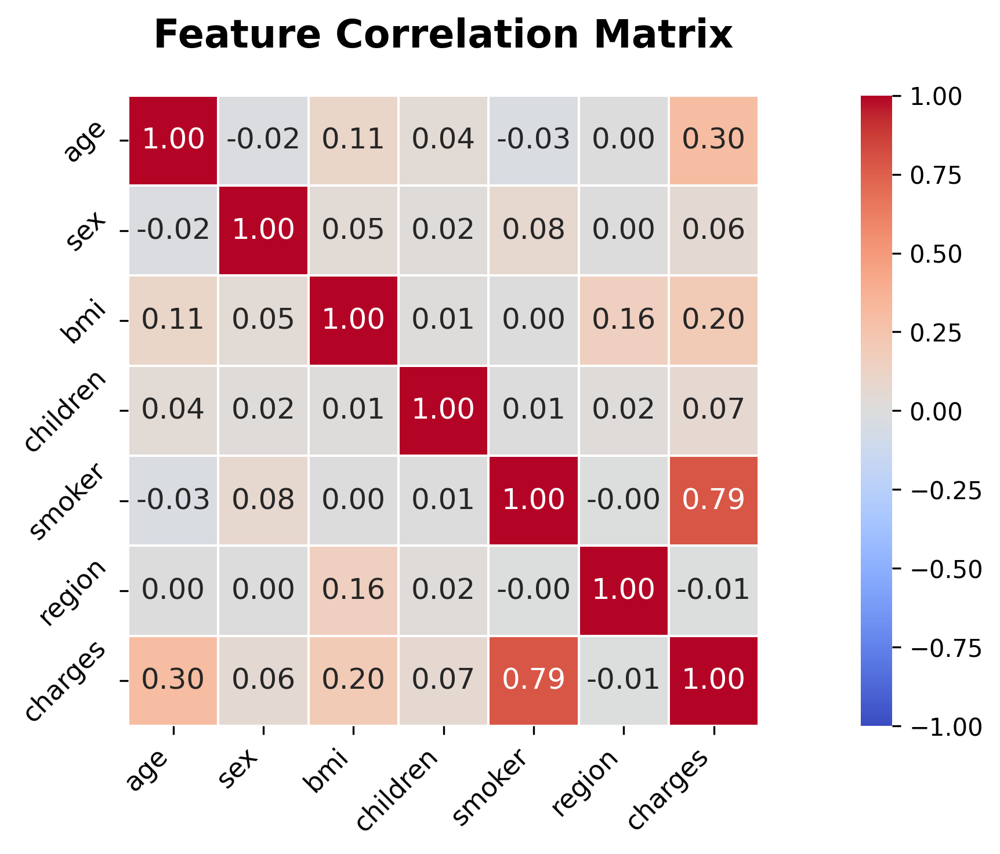
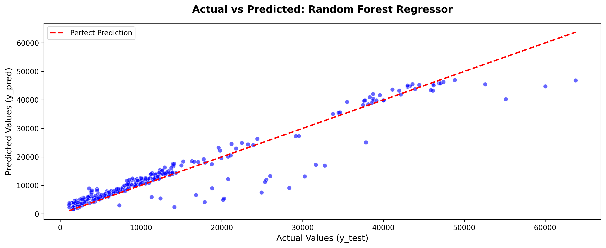
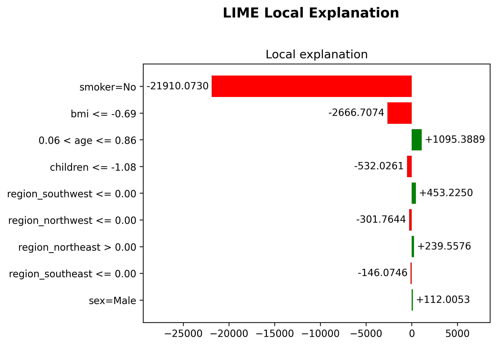
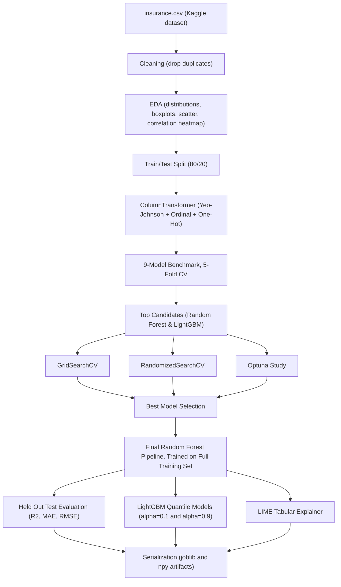

# 🏥 Medical Insurance Cost Prediction with Regression, Quantile Intervals & LIME Explainability


## 📌 Overview

This repository contains a single, end to end Jupyter notebook (`medical-cost-prediction.ipynb`) that predicts an individual's medical insurance charges from six demographic and health features. Rather than stopping at a single "best model" and calling it done, it treats a cost prediction as three separate questions. Which model fits best, how confident should that estimate actually be, and why did the model land on that number for this specific person.

The notebook covers the full pipeline in one place. It runs exploratory data analysis, a 9-model regression benchmark under 5-fold cross-validation, a three-way hyperparameter tuning comparison (`GridSearchCV` vs. `RandomizedSearchCV` vs. `Optuna`) for the two strongest candidates, a final held out test evaluation, LightGBM-based quantile regression to produce a prediction *interval* instead of a single number, and a per-instance LIME explanation so an individual prediction can be traced back to the specific features that drove it.

The underlying data is the [Medical Cost Personal Datasets](https://www.kaggle.com/datasets/mirichoi0218/insurance) from Kaggle. The original, runnable notebook, developed and executed on Kaggle, is also published here. **[Medical Cost Prediction on Kaggle](https://www.kaggle.com/code/viochristian/medical-cost-prediction)**

### ✨ Key Features
* 📊 **Full EDA suite.** Distribution plots, boxplots with outlier flags, scatter plots against the target, and a correlation heatmap, all auto-generated and exported as PNGs.
* 🥊 **9-model regression benchmark.** Linear, Ridge, Lasso, Decision Tree, Random Forest, XGBoost, LightGBM, KNN, and a Yeo-Johnson-transformed Linear Regression, all compared under the same 5-fold cross-validation setup.
* ⚙️ **Triple hyperparameter tuning comparison.** The two strongest candidates, Random Forest and LightGBM, are each tuned three separate ways using `GridSearchCV`, `RandomizedSearchCV`, and `Optuna`, so the tuning strategies themselves can be compared, not just the final numbers.
* 📈 **Prediction intervals, not just a point estimate.** Two additional LightGBM quantile regressors (10th and 90th percentile) are trained so every prediction can be reported as a Min, Prediction, and Max range instead of a single dollar figure.
* 🧠 **Per instance LIME explanation.** A single test patient's prediction is broken down feature by feature using `LimeTabularExplainer` in regression mode, with categorical features mapped back to human readable labels (`Female`/`Male`, `No`/`Yes`) instead of raw encoded numbers.
* 💾 **Serialized, reusable artifacts.** The final tuned pipeline, both quantile models, and the processed training matrix are all exported (`.joblib` / `.npy`) so they can be loaded and reused without re-running the notebook.

---

## 🎯 Context & Problem Statement

Before comparing models, it's worth being clear about what actually makes medical cost prediction harder than an ordinary regression problem, and about who actually runs into that difficulty in practice. These aren't abstract modeling concerns invented to justify a fancier pipeline. They're the same two issues an individual, a benefits administrator, or an underwriting analyst hits the moment they try to turn a person's basic profile into a usable cost estimate.

### 🏥 The Problem
Anyone trying to estimate what someone's annual medical costs might look like today, whether that's a person comparing insurance plans, an HR team budgeting for a workforce, or an analyst sanity checking a premium, tends to reach for the same simple tools first. Averaging historical costs by age bracket, or fitting a plain linear regression on a handful of demographic fields. Both approaches run into the same two concrete problems once you look past how easy they are to set up.
1. **Cost drivers aren't linear, and one feature dominates disproportionately.** A naive averaging or plain linear approach assumes each factor adds a roughly fixed amount to the bill. In reality that assumption breaks down hard. A plain linear model only reaches around 0.72 R² on this data because it can't capture how something like smoking status doesn't just add a fixed premium, it multiplies the entire cost curve for that person. Anyone budgeting off a simple linear estimate is working from numbers that miss exactly the interaction that matters most.
2. **A single predicted dollar figure hides both uncertainty and reasoning.** Even a more accurate model still just hands back one number, for example "your estimated cost is $9,304". That number alone doesn't say how far off it could plausibly be, and it doesn't explain which of the person's specific attributes pushed it up or down. A $9,304 estimate that could genuinely land anywhere between $4,000 and $20,000 depending on unstated risk factors is a very different thing from a tightly bounded one, and there is no way to tell the two apart from the number by itself.

### 💡 The Solution
Rather than treating this notebook as a single-model exercise where one algorithm gets picked and everything else is an afterthought, each of the two problems above maps onto a specific, deliberate piece of the pipeline built to close that exact gap, not a generic "make it more accurate" step tacked on for its own sake.
1. 🌲 **Addressing non-linear cost drivers.** Nine regression algorithms, ranging from simple linear baselines through tree ensembles and gradient boosting, are benchmarked under identical cross-validation so that interactions like the smoking effect actually get captured instead of averaged away, and the strongest non-linear performer is then tuned to squeeze out the best fit the data can support, reaching 0.90 R² on the held out test set. That is a level of accuracy a plain linear or bracket-averaging estimate has no realistic way of reaching.
2. 📏 **Addressing hidden uncertainty and reasoning.** Two LightGBM quantile regressors turn that single point estimate into a Min, Prediction, and Max range, so a $9,304 estimate comes with an honest sense of how wide the plausible outcome actually is instead of a false sense of precision. A LIME explanation is also generated for individual predictions, so the specific features behind a given number, like being a smoker or carrying a high BMI, are visible and traceable instead of simply assumed.

---

## 🧩 Tech Stack Highlights

| Layer | Tool | Role |
| :--- | :--- | :--- |
| **Data source** | [Kaggle Medical Cost Personal Datasets](https://www.kaggle.com/datasets/mirichoi0218/insurance) | 1,338 raw records of age, sex, BMI, children, smoker status, region, and charges |
| **Preprocessing** | `ColumnTransformer` (Yeo-Johnson `PowerTransformer`, `OrdinalEncoder`, `OneHotEncoder`) | Transforms numeric features, encodes binary and multi-category features |
| **Model benchmarking** | `scikit-learn`, `XGBoost`, `LightGBM` | 9-model comparison under 5-fold cross-validation |
| **Hyperparameter tuning** | `GridSearchCV`, `RandomizedSearchCV`, `Optuna` | Three tuning strategies compared for Random Forest and LightGBM |
| **Final point estimate model** | `RandomForestRegressor` (Optuna-tuned) | The main deployed prediction model |
| **Prediction intervals** | `LGBMRegressor` (quantile objective, α=0.1 and α=0.9) | Produces a Min to Max cost range around each point estimate |
| **Interpretability** | `lime.lime_tabular.LimeTabularExplainer` (regression mode) | Per instance, feature level explanation of a single prediction |
| **Serialization** | `joblib`, `numpy` | Persists the final pipeline, quantile models, and processed training data |

---

## 📊 Quantitative Metrics

### 🥊 Baseline Model Benchmark (5-Fold Cross-Validation, R²)

| Model | Mean R² |
| :--- | :---: |
| **Random Forest** | **0.8208** |
| LightGBM | 0.8169 |
| XGBoost | 0.7849 |
| Lasso Regression | 0.7207 |
| Ridge Regression | 0.7207 |
| Linear Regression | 0.7207 |
| Decision Tree | 0.6613 |
| KNN Regressor | 0.5871 |
| Yeo-Johnson Linear | 0.5554 |

The linear-family models (Linear, Ridge, Lasso, and the Yeo-Johnson-transformed Linear Regression) all plateau somewhere between 0.55 and 0.72, which is a direct confirmation of the non-linearity problem described above. Reweighting or transforming the same demographic inputs linearly still can't capture how the underlying cost curve actually bends. Random Forest and LightGBM are the only two models to clear 0.80, and they land close enough to each other, 0.8208 versus 0.8169, that picking a single winner from this table alone would have been premature. Instead of committing to Random Forest on the spot, both models were carried forward into the hyperparameter tuning stage below specifically to check whether tuning might close that small gap, or even flip the ranking entirely, since it's entirely possible for a search process to unlock more headroom in one model than the other.

### ⚙️ Hyperparameter Tuning Comparison (Best CV R²)

| Model | Strategy | Best CV R² |
| :--- | :--- | :---: |
| Random Forest | GridSearchCV | 0.8395 |
| Random Forest | RandomizedSearchCV | 0.8425 |
| **Random Forest** | **Optuna (selected)** | **0.8433** |
| LightGBM | GridSearchCV | 0.8369 |
| LightGBM | RandomizedSearchCV | 0.8407 |
| LightGBM | Optuna | 0.8403 |

All three tuning strategies were run for both models for exactly the reason raised above, to see whether a more exhaustive search (`GridSearchCV`), a broader but cheaper random sample of the search space (`RandomizedSearchCV`), or a guided, trial-by-trial search (`Optuna`) would change which model came out ahead, not just to squeeze a few extra points out of a model that had already been decided in advance. For Random Forest, Optuna's guided search found the best configuration by a clear margin over the other two strategies. For LightGBM, Optuna and `RandomizedSearchCV` landed close enough together that either one can come out marginally ahead, and in this run `RandomizedSearchCV` narrowly edged out Optuna. Random Forest kept the lead it held in the baseline benchmark regardless, so it was selected as the final model (`n_estimators=500, max_depth=27, min_samples_split=6, min_samples_leaf=10, max_features=None, bootstrap=True`), but the margin over the best tuned LightGBM result stayed narrow enough that either model would have been a defensible choice.

### 🏁 Final Model on the Held-Out Test Set (n=268)

| Metric | Score |
| :--- | :---: |
| **R²** | **0.9014** |
| **MAE** | **$2,458.56** |
| **RMSE** | **$4,255.67** |

*A quick sanity check on a 10-row subset, where the point prediction is reported alongside its 10th to 90th percentile quantile interval, reached an R² of 0.9925. That number is only illustrative of the interval mechanism, not a substitute for the 268-sample test metrics above.*

An R² of 0.9014 on data the model never touched during training or tuning means the final model explains just over 90% of the variance in actual charges, a noticeable step up from the roughly 0.84 cross-validation average seen during tuning, which is a normal amount of movement between a multi-fold average and a single held-out split. In dollar terms, the MAE of $2,459 means predictions land within about that amount of the actual charge on average, and the RMSE of $4,256 sits higher than the MAE as expected, since RMSE penalizes large misses more heavily and a handful of very high-cost patients are harder to predict precisely than the more typical ones.

---

## 🔍 Interpretability Highlights

* **Feature importance for the Random Forest model.** `smoker` dominates by a wide margin (Gini importance around 0.68), followed by `bmi` (around 0.18) and `age` (around 0.13). `children`, `sex`, and the one hot `region` columns each contribute under 0.02, meaning region has almost no effect on the model's predictions in this dataset.
* **LIME example for test instance #0.** The largest single driver was `smoker=No`, which pulled the prediction down by roughly $21,910 relative to the local baseline. This is a direct, human readable confirmation that smoking status is the dominant cost factor the model has learned, matching the feature importance ranking above.

---

## 📷 Screenshots (Optional)

If you'd like to add visuals to this README, up to 3 are recommended. See the note right after this section for exactly what to include.

### 1. Correlation Heatmap

*Pearson correlation matrix across the encoded features and the `charges` target, generated during EDA.*

### 2. Actual vs. Predicted (Final Model)

*Scatter plot of actual vs. predicted charges on the test set, with the diagonal line marking a perfect prediction.*

### 3. LIME Local Explanation

*Feature by feature contribution chart for a single test patient's prediction.*

---

## 📦 Output Artifacts

Running the notebook end to end serializes the following files into an `artifacts/` folder. These are trained model and data objects, not images.

| File | Format | What it is |
| :--- | :--- | :--- |
| `best_final_model.joblib` | joblib | The full preprocessing + Optuna-tuned Random Forest pipeline, used as the main point estimate model |
| `lgbm_lower_bound.joblib` | joblib | LightGBM quantile regressor (α=0.1) that produces the lower bound of the prediction interval |
| `lgbm_upper_bound.joblib` | joblib | LightGBM quantile regressor (α=0.9) that produces the upper bound of the prediction interval |
| `X_train_processed.npy` | NumPy | The preprocessed training feature matrix, used as the background/reference dataset for LIME |

---

## 🏗️ Architecture & Data Flow

### 🔄 End to End Notebook Flowchart



---

## 💻 Installation & Reproduction Steps

### 📋 Prerequisites
* **Python** 3.10+
* **Package Manager** pip
* A Kaggle account if you'd rather run it directly on Kaggle instead of locally (see the option below).

### 🅰️ Run It on Kaggle (No Local Setup Needed)
The notebook was originally developed and executed on Kaggle, with the dataset already mounted at `/kaggle/input/datasets/mirichoi0218/insurance/insurance.csv`. The easiest way to reproduce the exact results above is to open and run it directly there.

**[Medical Cost Prediction on Kaggle](https://www.kaggle.com/code/viochristian/medical-cost-prediction)**

### 🅱️ Run It Locally

#### 1. Clone the Repository
```bash
git clone https://github.com/viochris/medical-cost-prediction.git
cd medical-cost-prediction
```

#### 2. Create and Activate a Virtual Environment
```bash
# macOS/Linux
python3 -m venv venv
source venv/bin/activate

# Windows
python -m venv venv
venv\Scripts\activate
```

#### 3. Install Dependencies
```bash
pip install --upgrade pip
pip install -r requirements.txt
pip install jupyter
```

#### 4. Download the Dataset
Download the [Medical Cost Personal Datasets](https://www.kaggle.com/datasets/mirichoi0218/insurance) from Kaggle, either manually or via the Kaggle API/`kagglehub`, and update the `file_path` variable near the top of the notebook to point to wherever you saved `insurance.csv` locally.

#### 5. Run the Notebook
```bash
jupyter notebook medical-cost-prediction.ipynb
```

---

## ✅ Conclusion

Put together, this notebook shows that the two problems laid out at the start, non-linear cost drivers and a single number hiding both uncertainty and reasoning, can both be addressed without reaching for exotic tooling. A carefully benchmarked and tuned Random Forest closes most of the accuracy gap left by naive linear or bracket-averaging approaches, reaching 0.90 R² on data it never saw during training, while the added quantile regression and LIME layers turn that one number into something closer to what a person actually needs to act on it, a plausible range, and a reason behind it. That said, this is still a single, self-contained analysis rather than a finished, deployable product, and the two sections below are meant to be read together. The limitations spell out exactly where the current version falls short, and the future work section spells out what would specifically need to change to close each of those gaps.

---

## ⚠️ System Limitations

### 🏗️ Architectural Limitations
* **Hardcoded dataset path.** The CSV path is a fixed Kaggle input path written directly into the notebook. Running it outside Kaggle means manually finding and editing that one line before anything else will work, which is easy to forget and easy to get wrong on a first attempt, and it means the notebook can't simply be cloned and run as is.
* **Notebook only, no app layer.** This repository is a research and analysis notebook, not a deployed tool. There is no Streamlit, Gradio, or API layer sitting on top of the serialized artifacts, so anyone who isn't comfortable opening and running a Jupyter notebook currently has no way to get a prediction out of this project at all.
* **Small quantile interval sanity check.** The Min, Prediction, and Max demo is only run on a 10-row subset of the test set as an illustrative example, not evaluated as a properly calibrated interval across the full 268-row held out set. That means there is currently no real evidence for how often the true cost actually falls inside the predicted interval at scale, only that the mechanism works on a handful of examples.

### 🔬 Model & Domain Limitations
* **Small dataset.** After removing 1 duplicate row, training draws from only 1,337 total records, 1,069 of which went into the training split. That is a small enough sample that unusual combinations, an older smoker with a very high BMI in an underrepresented region, for example, may barely appear in training at all, so predictions for those less common profiles should be trusted less than predictions for typical ones.
* **Heavy reliance on a single feature.** `smoker` alone accounts for roughly 68% of the Random Forest's feature importance. That concentration means the model's behavior is largely governed by one binary flag, which makes it fast to learn from this dataset but also means the model would likely be far less reliable on a population where smoking status is missing, misreported, or simply a weaker cost signal than it is here.
* **Region contributes almost nothing.** The one hot encoded `region` columns each show near zero importance in this dataset. In reality, healthcare pricing does vary geographically, so this likely reflects the dataset's limited sample size per region rather than genuine evidence that location doesn't matter for medical costs in general.
* **LIME explanation shown for a single instance.** Only one test patient, index 0, is explained in the notebook as a demonstration of the mechanism. It has not been run across the rest of the test set, so there is no current evidence for how stable or consistent LIME's explanations are from one similar patient to the next.

---

## 🚀 Future Work
* **Wrap the artifacts in a lightweight app.** Load `best_final_model.joblib` and the two quantile models into a small Streamlit or Gradio interface, similar in spirit to the maternal health risk apps elsewhere in this portfolio, so a non-technical user can get a point estimate, an interval, and a LIME explanation through a form instead of needing to open and run the notebook themselves.
* **Parameterize the dataset path.** Replace the hardcoded Kaggle path with a CLI argument, environment variable, or config value, so the exact same notebook or an equivalent script can run unmodified on Kaggle, on a laptop, or in a CI job, rather than requiring a manual edit every time the environment changes.
* **Full-set quantile interval evaluation.** Extend the current 10-row Min, Prediction, and Max demo into a proper coverage check across the entire 268-row held out set, measuring what fraction of actual charges genuinely fall between the predicted lower and upper bounds, which is the real test of whether the interval is trustworthy rather than just illustrative.
* **Try SHAP alongside LIME.** Compare LIME's local explanations against SHAP values for the same set of instances, since SHAP offers stronger theoretical consistency guarantees, to see whether the two methods agree on which features matter most or whether they tell noticeably different stories for the same patient.
* **Explore stacking or ensembling.** `StackingRegressor` is already imported in the notebook but currently unused. Given how close Random Forest and LightGBM ended up performing after tuning, combining their predictions could plausibly outperform either model alone if their errors turn out to be only weakly correlated.
* **Collect or source more data.** Because the current dataset is limited to 1,337 records, a natural next step would be to source a larger or more geographically diverse insurance dataset, which would help validate whether patterns like the near-zero importance of `region` hold up or turn out to be an artifact of this specific dataset's size.

---

## 📄 License
This project is licensed under the **MIT License**. See the [LICENSE](LICENSE) file for details.

---
**Author:** [Silvio Christian Joe](https://github.com/viochris)

*"A cost estimate is only as useful as the range and the reasoning behind it."*
